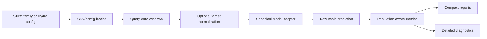

# Code architecture

TSFM is an inference-only evaluation boundary around official forecasting
packages. The formal task is in
[`method_overview.pdf`](../latex/method_overview.pdf).

## Package ownership

| Owner | Responsibility |
|---|---|
| `src/data/` | Wide-CSV loading, configuration, TIME preparation, and query construction |
| `src/external_models/` | Thin Chronos and TS-ICL adapters |
| `src/model_loading/` | Canonical aliases, capability declarations, and controls |
| `src/evaluation/` | Deterministic inference, inverse transforms, timing, and metrics |
| `src/pipeline/` | Cadence-aware tasks, run identities, and manifests |
| `src/results/` | Selection, comparisons, marginal tables, and report manifests |
| `src/visualization/` | Per-configuration plots and artifact-only analysis |

## Runtime path

The evaluator loads one complete model, iterates query dates in deterministic
date-major order, forecasts every user, reverses target preprocessing, and
accumulates metrics without storing forecast arrays. Reports read completed
summaries. Large per-configuration plots and averaged aligned inputs live under
`diagnostics/`, separate from publishable `reports/`.

## Important boundaries

- The project does not train or reimplement a foundation model.
- Covariates are explicit and rejected by adapters that do not support them.
- Evaluation owns accessible dates, not upstream model behavior.
- Run manifests describe scientific configuration rather than storage state.
